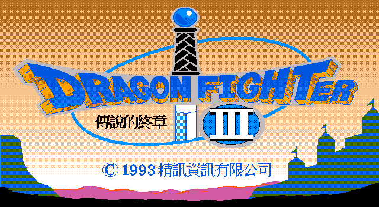
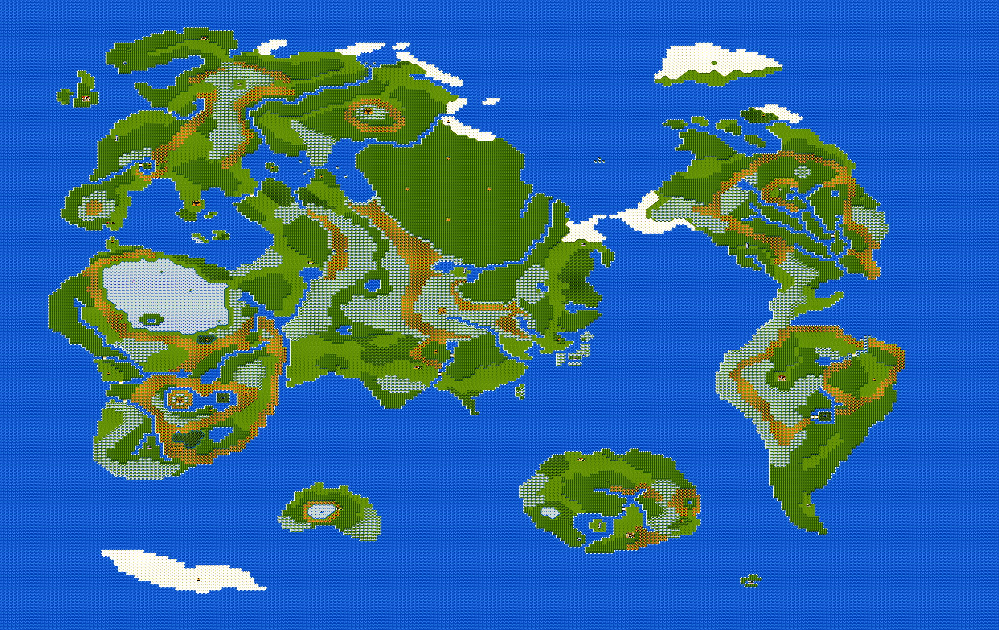
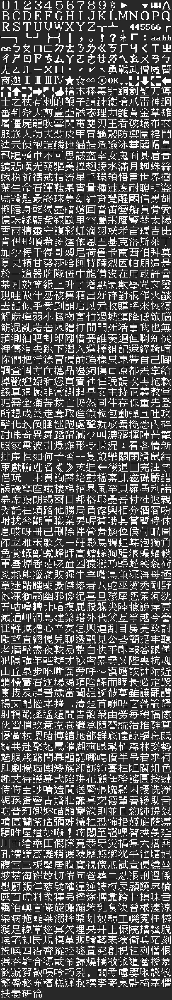
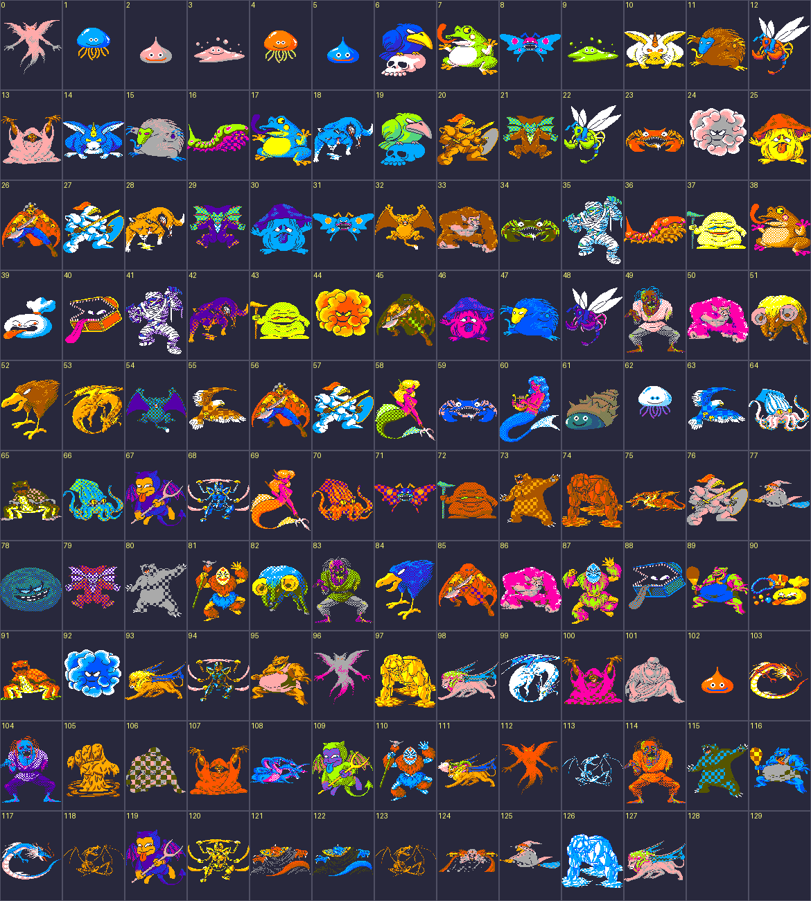
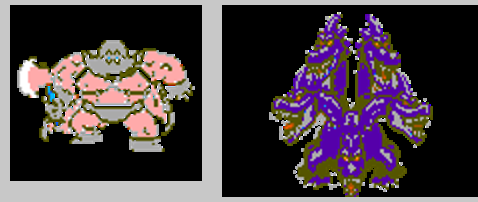

# 精訊版《勇者鬥惡龍 III：傳說的終章》反組譯

中文標題「傳說的終章」對應日版 DQ3《そして伝説へ…》（精訊版改名為 *Dragon Fighter 3* 以避商標）。本 repo 記錄精訊資訊（King Information）在 1990 年代製作、**最終未發售**的中文版 DQ3 的反組譯與素材還原工作。

## 成果展示

從原版資料檔反組譯、解碼、還原出的成果（皆由 `tools/` 內的工具從原始素材重新產生）。標題、開場、主選單、城鎮 tile / palette 已在 **DOSBox 實機跑原版逐張比對驗證**（見 [`docs/14`](docs/14-dosbox-validation.md)），與還原結果一致：

**標題畫面**（`TITG.P` → 解出為標準 ZSoft PCX：640×350、4bpp、RLE、palette 內含於檔）：

**開場畫面**（`FIRST.SCR` → 640×350 4bpp row-interleaved planar 解碼）：

**世界地圖**（`DQ3CON.MAP` 244×205 + `DQ3.BLK` tile 圖庫 + `DQ3.PAL`）：

**遊戲內中文字庫**（`D3TXT00.FON` 完整 1,476 字：拉丁／注音／職業／武器／防具／道具／咒文）：

**怪物圖鑑**（`DQ3MNS.SHP` sprite + `mnsbk.pal`，128 隻全彩；id 5 = 史萊姆、id 2 = 金屬史萊姆，數值見 [`docs/data/d3mns_stats.json`](docs/data/d3mns_stats.json)）：

**復原未完成的 sprite**（未發售版只有 130 隻中 **2 隻沒做完**:id 128 歐里狄加、id 129 五頭龍大王——正是索瑪城「父親 vs 五頭龍」決鬥那場戲的雙方,缺圖導致該戰當機。依參考圖以精訊風格重繪、注入原格式,經遊戲 SHP 解碼器驗證):

> 城鎮地圖（`CTY*.DAT`）見 [`docs/maps/cty00_town.png`](docs/maps/cty00_town.png)；劇情純文字劇本見 [`docs/script/`](docs/script/)；更多標題 / 過場圖（片尾、年代過場）見 [`docs/title/`](docs/title/)。

## RE 正確性驗證 + 修正版

**反組譯正確性已證實(兩個層級):**
- **素材**:標題 / 開場 / 主選單 / 城鎮 tile / palette 在 [DOSBox 跑原版逐張比對](docs/14-dosbox-validation.md)一致。
- **程式碼**:整檔反組譯 → nasm 重組,`sha256` 與原版**逐 byte 100% 相同**([docs/17](docs/17-build-toolchain.md))。
- 原版編譯器經逐函式指紋鎖定為 **Microsoft C 5.x**([docs/19](docs/19-re-correctness.md));byte-match PoC 已通。

**精訊 DQ3 修正版(binary patch 對照組,7 個 bug 處理 5 個)** —— 證明 RE 能精準修原版([docs/18](docs/18-bug-analysis.md)、[docs/20](docs/20-fixed-version.md)):

| Bug(青衫先生記錄) | 修法 |
|---|---|
| 巴拉摩斯打不死 / 彩虹水滴卡關 / 勇者 MP 固定+1 / 隼劍只打一次 | ✅ EXE binary patch(共 25 byte,同長度不位移)|
| 九頭龍/歐里狄加戰當機 | ✅ **重繪未完成的 sprite 補圖**(父子決鬥雙方)|
| 祈禱之戒 | ✅ 反組譯確認本就生效,不需修 |
| 高等級升級錯亂 / 數值 255 溢位 / 魔甲無抗魔 | ⬜ 留「C 重編」修(real-mode 無 cave 空間)|

> 兩階段策略:**(a) binary patch 對照組(已完成)→ (b) 從 re 出的 C source 重編** —— bug 修進 C(無 real-mode 限制)、用 MSC 5.1 重編出 `RE-DQ3.EXE`,並以此乾淨 C 為基礎做 SDL2 現代移植。

## 目標

1. **反組譯主程式 → 用 SDL2 重寫成現代版** — 還原 `DQ3.EXE` 的程式邏輯。經偵察與逐函式指紋，它是 **16-bit real-mode、near-code model 的 DOS C 程式，由 Microsoft C 5.x 編譯**（非保護模式、非 Pascal、非 large model；先前依檔頭 `MZP` 與遠呼叫的判斷已逐步更正，詳見 [`docs/05`](docs/05-exe-recon.md)、[`docs/07`](docs/07-dpmi-note.md)、[`docs/19`](docs/19-re-correctness.md)），鏈結手寫組語的硬體驅動。最終目標:把它**用現代 C + SDL2 跨平台重寫**,以 DOSBox 原版為 oracle 驗證一致。
2. **拆解遊戲素材** — 字型、地圖、圖檔、文字腳本、音樂音效等，還原成可檢視 / 可再利用的格式。
3. **挖掘技術** — 記錄這套未發售中文版採用的中文字型、文字編碼、地圖與封包等技術細節。

## 驗證方式

還原產出須能重建並在 **DOSBox**（容器內執行，不污染 host）跑出與原版一致的行為，以原版執行畫面為黃金對照基準。

## 版權與素材

原始遊戲檔（`DQ3.EXE` 與全部素材）版權屬 Enix / 精訊資訊，**不納入本公開 repo**。要重現本專案的工作，需自行提供原版 `dq3.zip` 並解壓到 `assets_raw/`（已被 `.gitignore` 排除）。本 repo 只記錄：

- 反組譯產出的 C 原始碼 + SDL2 重寫（`re/`）
- 格式分析與技術文件（`docs/`）
- 操作原始檔的工具腳本（`tools/`）

## 目錄結構

| 目錄 | 內容 |
|---|---|
| `re/` | 反組譯重建的 C 原始碼 + SDL2 移植（`re/sdl/`）|
| `docs/` | 格式分析、結構地圖、技術筆記 |
| `tools/` | 解析 / 抽取 / 渲染素材的腳本（Python，於 docker uv venv 執行） |
| `references/` | 外部參考資料（青衫先生攻略等） |
| `assets_raw/` | （git 排除）原版素材，使用者自備 |
| `assets_out/` | （git 排除）抽出的素材產物 |

## 進度

逐迭代推進，每輪有產出即更新本 repo。

| 項目 | 狀態 | 文件 |
|---|---|---|
| 資產 inventory 與格式偵察（194 檔） | ✅ | [`docs/01-asset-inventory.md`](docs/01-asset-inventory.md) |
| 字型解碼 | ✅ | [`docs/02-font-format.md`](docs/02-font-format.md) |
| 文字腳本解碼 + 純文字（UTF-8）dump | ✅ | [`docs/03-text-format.md`](docs/03-text-format.md)、[`docs/script/`](docs/script/) |
| 地圖 tile + 世界地圖還原（城鎮佈局待 EXE） | ✅ | [`docs/04-map-format.md`](docs/04-map-format.md)、[`docs/maps/`](docs/maps/) |
| `DQ3.EXE` 反組譯 → C | 🔄 主結構成 C(啟動/主迴圈/狀態機/野外指令/對話/戰鬥/場景/素材載入/注音輸入) | [`docs/05`](docs/05-exe-recon.md)–[`19`](docs/19-re-correctness.md)、[`re/`](re/) |
| RE 正確性確認(原版編譯器 = **MSC 5.x**,byte-match 驗證) | 🔄 方法已證、擴展中 | [`docs/19`](docs/19-re-correctness.md)、[`docs/17`](docs/17-build-toolchain.md) |
| 最終目標:SDL2 現代跨平台重寫(DOSBox 原版當 oracle) | 🔄 骨架 PoC(SDL 顯示標題)| [`docs/17`](docs/17-build-toolchain.md)、[`re/sdl/`](re/sdl/) |

### 已解出的重點

- **字模格式**：三個 `.FON` 共用 16×16 row-major MSB 點陣（字身 16×14，row14/15 為行距留白）。
- **`D3TXT00.FON`**：完整解出 1,476 字 = 遊戲內全部字元（拉丁／注音／職業／武器／防具／道具／咒文／符號）。
- **`CHINA.FON`**：變位母字庫（~5,400 字），run-based 相位對齊正確率 ≈93%。早期誤判的「字模混淆」已更正為 **1-byte 對齊漂移**（`deobf@b ≡ read@(b−1)`，非防拷混淆）。
- **`D3TXT00~09.TXT`**：遊戲對話／劇情腳本。指標表 + 2-byte LE 記錄（`0xffff` 終止）；值 `<1476` 為 `D3TXT00.FON` 字模索引，`>=0xffed` 為控制碼（換行／換頁／動態插值）。逐碼 render 出通順繁體中文劇情（道具說明、各城鎮 NPC、結局、下層 DQ1 世界）。

### 待續

- glyph index → Unicode 對照表（OCR 1,476 字模）→ 把劇情 dump 成純 UTF-8。
- `CHINA.FON` 殘留 ~7% 對齊、段內索引表精確語意。
- 地圖（`DQ3*.BLK` / `CTY*.DAT`）格式與還原。
- `DQ3.EXE`（Microsoft C 5.x）反組譯為 C、byte-match 確認後用 SDL2 重寫。
