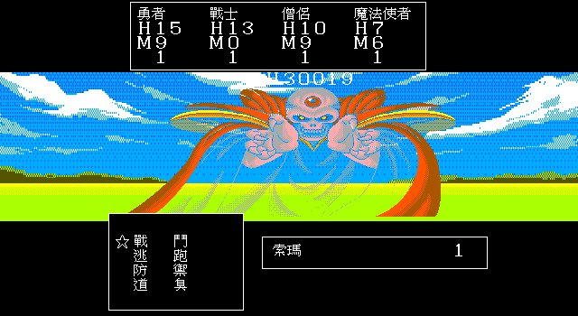

# 精訊版《勇者鬥惡龍 III》反組譯與 remake

本專案研究精訊資訊在 1990 年代製作、未正式發售的中文版 DQ3
（程式內題名 *Dragon Fighter III／傳說的終章*），並以原版 DOS 程式與資料為證據，
製作可在現代平台執行的 Go／Ebiten remake。

目前仍在開發中，**尚不能宣稱完成或忠實重現全程**。已經有許多可玩的系統與主線事件切片，
但仍缺少「從全新遊戲開始，不使用 debug 鍵或環境變數，依正常玩家操作一路抵達 THE END」
的完整驗收。現行完成定義與缺口以
[`docs/74-ebiten-remake-completion-plan.md`](docs/74-ebiten-remake-completion-plan.md) 為準。

## 先讀這些

- [`PROJECT_MEMORY.md`](PROJECT_MEMORY.md)：接手時應保留的少量穩定決策。
- [`CONTEXT.md`](CONTEXT.md)：術語、位址口徑與文件索引。
- [`docs/74`](docs/74-ebiten-remake-completion-plan.md)：Go／Ebiten remake 的唯一現行完成計畫。
- [`docs/69`](docs/69-why-remake-looked-done-but-wasnt.md)：先前多輪 remake 看似完成、實際未完成的原因。
- [`docs/00`](docs/00-re-methodology.md)：反組譯方法、證據分級與常見陷阱。

舊 Markdown 是研究線索，不自動等於現況。若文件、程式與原版證據衝突，應重新檢查
`DQ3.EXE`、原始資料、DOSBox 實機或本機完整影片。

## 現行產品

### `dq3_remake_ebitan/`：主要 remake

Go 1.24 + Ebitengine 的跨平台實作，是目前應繼續完成的產品線。現有內容包括：

- 原版 palette、BLK、地表、CTY、角色、文字、怪物、道具與音訊資料解析器。
- 新遊戲姓名／性別、開場家中、母親事件、王城獎勵、酒場登錄與四人隊伍。
- 地表／城鎮移動、NPC、日夜、門與轉場、商店、宿屋、教會、道具、裝備與存讀檔。
- 多敵戰鬥、角色成長、部分戰鬥咒文與原版怪物資料。
- 船、不死鳥、巴拉摩斯後下降、部分終盤事件與結局切片。
- 魯拉、烈米特、特黑洛斯、拉那魯達的原版 MP、場景 gate 與核心效果。
- 桌面共用輸入、觸控層與 Android 綁定骨架。

這份清單只表示系統或事件切片已存在，不代表整個 campaign 已由正常流程閉合，也不代表所有
畫面、聲音、參數及副作用都已完成原版對拍。

目前可見成果：




### `dq3_remake/`：C99 + SDL2 參考實作

此目錄保存較早的現代化 C prototype、parser、測試與實驗性流程。它對理解既有機制很有用，
但**不是原版 oracle，也不是 Go 版可以無條件照抄的設定資料**。其中有些參數、事件入口與
流程是早期近似；移植前仍須回到原版證據核實。

### `re/`：反組譯筆記與部分 C 重建

此目錄保存對 `DQ3.EXE` 的函式分析、資料結構與部分 C 表達。專案已有可重組原位指令的
工具鏈與 byte-match PoC，但這不等於「整支遊戲已被完整反編譯成乾淨 C，且重編後與原版
逐 byte 相同」。實際完成範圍請查 [`docs/17`](docs/17-build-toolchain.md)、
[`docs/19`](docs/19-re-correctness.md) 與 [`docs/25`](docs/25-match-progress.md)。

## 完成 remake 的判準

只有同時具備以下證據，才可宣稱完成：

1. 從全新遊戲開始，只用正式玩家輸入抵達 THE END。
2. 主要事件入口、順序、gate、勝敗分支、道具與旗標交易對齊精訊版。
3. 關鍵 UI、角色／NPC、地圖、日夜、轉場、音樂及音效有原版畫面或資料佐證。
4. 關鍵事件前後可正常存檔、讀檔並繼續。
5. 桌面版與 Android 共用同一套 Go game core，正常流程不依賴 debug shortcut。

編譯成功、單元測試全綠、直接呼叫內部 handler，或分別證明終盤切片可執行，都不足以證明
整個 remake 已完成。

## 證據優先序

1. 原版 `DQ3.EXE`、CTY、D3TXT、ITEM、怪物及其他原始資料。
2. DOSBox 同狀態、同輸入的原版實機結果。
3. 本機完整通關影片，用於畫面、操作順序與路線；修改過的角色數值不作參數 oracle。
4. 當年 BBS 與攻略，用於找路線及歷史交叉佐證。
5. C/SDL remake 與舊文件，只作線索，不作最終事實來源。

反組譯結論應記錄 `writer → table/state → consumer → 玩家可見副作用`。位址必須標明
`file offset`、`logical` 或 `DGROUP`，不可混用。

## 建置與測試

原版素材不納入 repo。請把合法持有的檔案放在 `assets_raw/`。

```bash
bash dq3_remake_ebitan/build.sh
```

桌面執行方式與 Android 建置需求見
[`dq3_remake_ebitan/README.md`](dq3_remake_ebitan/README.md)。

圖形測試應在 Xvfb 下編譯 `game.test` 後，從 `dq3_remake_ebitan/game/` 執行，才能讓
`../../assets_raw` 指向正確素材位置。測試輸出中的素材缺失 `SKIP` 不可當作通過。

## 主要資料與工具

| 路徑 | 用途 |
|---|---|
| `dq3_remake_ebitan/` | 現行 Go／Ebiten remake |
| `dq3_remake/` | C99／SDL2 歷史參考實作 |
| `re/` | 反組譯註記與部分 C 重建 |
| `docs/` | RE 證據、格式、流程與歷史文件 |
| `tools/` | 抽取、渲染、反組譯與 DOSBox 驗證工具 |
| `dq3_real_video/` | 本機原版實況（不納入 Git） |
| `assets_raw/` | 原版素材（不納入 Git） |

本機可使用：

- `tools/dis.sh`：16-bit Capstone 線性反組譯。
- `/home/anr2/ida_94_official/`：IDA Pro 9.4；IDB、授權檔與發佈包不得加入 repo。
- `tools/dosbox_*.sh`：原版實機重播與截圖。

## 已確認的研究成果

以下是已有直接證據、且不等同「remake 已完成」的研究成果：

- 16×16 繁中文字模、D3TXT 記錄、CTY section、BLK tile、地表與怪物等格式已可解析。
- 原版為 16-bit real-mode DOS 程式；編譯器與函式指紋研究見 `docs/19`。
- 原版 bug、當年 patch 與 BBS 記錄已有多項交叉驗證。
- 場景、戰鬥、NPC、遭遇、咒文與事件 runner 的多個資料表及 consumer 已被定位。
- 專案另有兩張補繪 boss sprite；它們是 remake 的修復資產，不應誤稱為原版完成素材。

素材範例：


## 版權

原始遊戲程式、文字、音樂與美術版權屬其權利人，不納入本 repo。研究與 remake 執行需由
使用者自行提供合法持有的原版素材。本專案文件中的歷史敘述以保存的 BBS 記錄為來源；
對未能由一手資料獨立確認的細節，不作更強的事實斷言。
