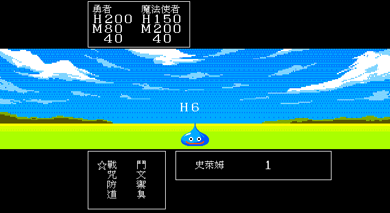
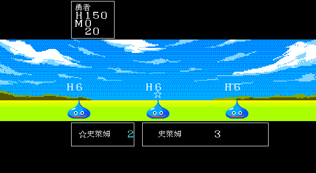
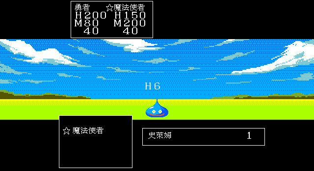
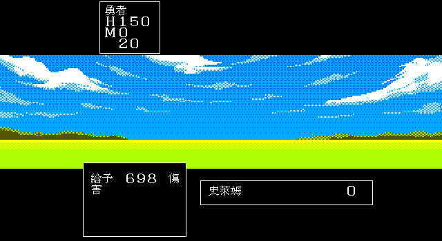
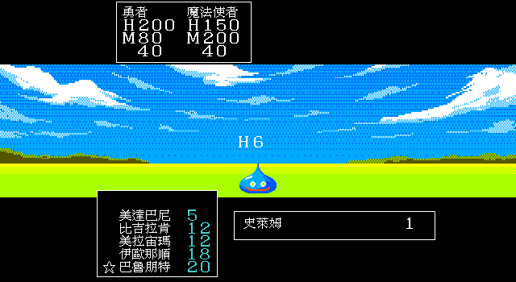

# 78 — 場景咒文與巴魯朋特 RE 契約（2026-07-28）

本文件只記可重用證據與未決事項。目標是避免後續又從 C remake 的近似值反推原版。
位址皆為原始 `DQ3.EXE` file offset；分析以 `tools/dis.sh` 與 IDA Pro 9.4 交叉確認。

> **2026-08-22 現況訂正：**本日較早的 Go `fieldspell.go` 只列 rec172–179 工具咒，當時
> 尚未接原版非戰鬥回復咒文；因此本文過去把「field caster 已接」縮寫成場景咒文完成，會
> 遮蔽核心玩家功能缺口。IDA Pro 9.4 sidecar `work/field-heal-ida-20260822.json` 已確認：
> `sub_1CB3C` 以 `rec-0x79` 查 `DS:37C3`、檢查 MP；descriptor flags 同時以 bit `0x08`
> gate `sub_188A9→sub_1885F` 的隊伍選人，並在共通施法後扣 `[caster+0x18]` MP；bit `0x02`
> 才進 `DS:38CC` effect pointer table。後續 [`docs/171`](171-field-healing-spell-production-spec.md)
> 已閉合 rec161–165 的 descriptor、共用 HP writer、單體／全體 consumer 與正式輸入交易，
> 並由 `spells.json` 接線為 E2；逐 frame／PCM wall-clock 仍非 V3。

## 真正的咒文施放路徑：已證實（D2）

- `0x1c9ee`：咒文選單；`0x1cb3c`：field caster。後者以
  `spellID = rec-0x79`、stride 3 查 DGROUP `0x37c3`：
  byte0=MP、byte1=base、byte2=target/effect flags，先檢查並扣施法者 `[member+0x18]` MP。
- field effect pointer table 位於 DGROUP `0x38cc`，以 `spellID-0x28` 索引。
- 真正魯拉 handler 是 file `0xe0da`；它通過場景 gate 後呼叫
  `0xe288 → 0x5e66 → 0x5f9b`（16-bit near-call IP 回繞）。
- `0x5e66` 建立目的地選單；`0x5f9b` 執行傳送。相同目的地效果也會被回城道具共用；
  舊文件把 `0x5140` 道具派發入口直接稱作魯拉入口，口徑錯誤。
- DGROUP `0x0ac0` 的目的地 index → CTY：
  `0,1,2,3,4,6,12,16,15,17,47,21,39,43,38,79,81,84,85,86`。
- `0x5e66` 讀 `[CTY + 0x506a]` 的造訪 bit，只有已解鎖目的地進選單。
- `0x5f29..0x5f32` 使用 `0x1ef + destination index` 作 D3TXT00 正式地名 record。
- `0x5fbb` 以 CTY 查 `cty_loc`，寫 world `X=ctyX-1, Y=ctyY`。
- destination index 10（CTY47）在 `0x5fd9` 另將 X 加 2，最後為 `ctyX+1`。
- 因此「回城內最後位置」及「魯拉、烈米特共用 RETURN_TOWN」都不是原版契約。

原版 caster 在 MP 足夠且通過施法者前置檢查後，會先播放共通施法流程並扣除 MP，之後才
派發 effect handler。目的地取消或 handler 的場景失敗沒有一般退款分支。因此 Ebiten
現行「效果成功／目的地選定後才扣 MP」是待修正差異，不得寫成原版契約。已造訪城鎮會存檔。
舊存檔只安全遷移必然起點 CTY0 與讀檔時所在城鎮，不猜測其他旅行紀錄。

## MP 與場景 gate：已證實（D2）

| rec | 咒文 | MP | handler | 已證實效果 |
|---|---|---:|---|---|
| 172 | 魯拉 | 8 | `0xe0da` | 地表可用；CTY 需 section header `+0x10 bit0`，再進共用 20 城選單 |
| 173 | 烈米特 | 8 | `0xe10c` | 必須在 CTY scene 且 header `+0x10 bit1`，成功後回地表 remembered position |
| 174 | 因帕斯 | 3 | `0xe13b` | CTY 面向事件：type2→rec254，其餘 type→rec253；非事件→rec346 |
| 175 | 多拉瑪那 | 2 | `0xe18c` | 設 `0x2000`；保護第一次踏入的同一段 `AH&0x0c` 傷害地板 |
| 176 | 特黑洛斯 | 4 | `0xe19c` | 設世界 repel flag，`[0x52f6]=0x28`（40 步） |
| 177 | 拉那魯達 | 12 | `0xe1ab` | CTY scene 內拒絕；地表切換 day/night state 並重載 palette |
| 178 | 雷姆歐魯 | 15 | `0xe1df` | 設 world flag `0x8000`、`[0x52f7]=0x19`（25 個有效移動步） |
| 179 | 阿巴卡姆 | 0 | `0xe1f2` | 設 door permission 4，呼叫 `0x14906` 開面向的 tier 1..3 門 |

Ebiten 已新增 CTY `MapFlags` parser，移除「用 dungeon BGM 猜烈米特可用」的舊 gate，
並將 MP 與特黑洛斯步數改為上表原值。雷姆歐魯已接入選單、25 步 consumer 與
party／vehicle occupant renderer；原版 expiry routine file `0xaaca` 在 timer 歸零時清除
world flags `0xc000`。目前為靜態資料流與 Go production-input 回歸（D2），仍待 DOSBox
同狀態畫面升 D3。阿巴卡姆的 door consumer 會先改中心門，再由 file `0x14a49` 掃相鄰
8 格的連續門片；非 CTY、面向非門或其他失敗會顯示 D3TXT00 rec `0x15a`。Ebiten 已接
0 MP 全門權限、相鄰門片 mutation 與全域失敗訊息。

因帕斯會把 examine mode `[0x0b5d]` 暫設 2；file `0x9cf6` 因而在讀出事件表
`{type,param,flag}` 後立即返回 `bp=type`，不開箱、不傳送。精訊版 D3TXT00 的 rec253
實際是存檔詢問，rec254 只有變數控制碼，並不是可由 FC 版常識代換的「藍／紅」台詞；
Ebiten 保留這兩筆原始 record。handler 另以 `[0x25d3]=3/1` 呼叫色彩效果
file `0x10305`，該動畫尚未接，因此目前 D2／V1。

多拉瑪那的 handler 雖同時寫 `[0x52f8]=0x28`，一般 movement timer consumer
file `0xa91c` 卻檢查 world bit `0x0200`，不是 handler 寫入的 `0x2000`。真正 consumer
file `0x197a8` 在 tile attr 高 byte符合 `AH&0x0c` 時，將 `0x2000` 清掉並轉成
guard `0x0400`；離開 hazard 後 guard 即清，因此只保護第一次踏入的同一段連續區域。
`AH&0x03` 分支在檢查多拉瑪那前就造成全隊 1–3 傷害。Ebiten 依此保留精訊版行為，
未擅自改成 FC 式持續免疫。

## rec180 巴魯朋特是戰鬥咒文：已證實（D2）

rec180 descriptor 是 DGROUP `0x37c3 + 59*3` 的 `14 00 01`：MP 20、base 0、
flags `0x01`。場景 caster file `0x1cb3c` 只有在 `flags & 0x02` 時才會呼叫
field effect table，因此 rec180 不屬於上表，也不應出現在場景咒文選單。它的實際
handler 是 battle dispatcher 內的 file `0xe5d8`。

handler 以 `rng(16)` 查 DGROUP `0x3908`。原始 16-word table 為：

```text
0:d284  1:NULL  2:d291  3:NULL  4:NULL  5:NULL  6:NULL  7:NULL
8:d291  9:NULL 10:NULL 11:d298 12:d2a1 13:NULL 14:NULL 15:NULL
```

所以原版是 5 個有效 slot、4 個唯一 handler，而不是 16 種已實作效果；11/16 直接走
rec346「但是這個咒文沒有效。」：

| roll | file handler | 原版資料流與玩家可見結果 |
|---:|---|---|
| 0 | `0xe5f4` | effect type3 對各存活敵做 spell resistance 判定並設睡眠；接著每名存活隊員各以 `rng(256)<0x96` 設睡眠，訊息 rec338/339 |
| 2、8 | `0xe601` | `BP=0x55 → 0xdfec → 0x5a5b`，逐名存活隊員獨立回復 85–94 HP、封頂 max HP，訊息 rec360 |
| 11 | `0xe608` | `0xea37` 逐敵依 resistance 判定，成功者 HP=0 並從敵群移除，rec317「被吹走了」；不算擊殺報酬 |
| 12 | `0xe611` | effect type1 隨機選一名存活敵，由敵 struct `+0x10` 吸取最多 10 MP 並直接加到施法者 MP，rec318 |

這條 MP consumer 也把 D3MNS.DAT `+0x04`（生成時複製到敵 struct `+0x10`）從舊文件的
不明 `f04` 定錨為戰鬥 MP。spell resistance 由 file `0xeb6b` 使用 D3MNS
`+0x19..+0x1d` 的 packed 2-bit 類別，映射成功門檻 `0/68/180/255`。

Ebiten 已加入 rec180 的 20 MP battle descriptor、原版 16-slot dispatch、怪物 MP 與
packed resistance consumer。戰鬥 UI 也已改為逐名存活、可行動隊員下令；魔法使同伴會使用
自己的已學咒文與 MP，因此 rec180 現在可由正常戰鬥輸入選到。

### 戰鬥命令與行動順序

- D3TXT00 rec441：戰鬥／咒文／防禦／道具（會咒、不可逃）。
- rec442：戰鬥／逃跑／防禦／道具（不會咒、首位可行動者）。
- rec443：戰鬥／咒文／逃跑／道具（會咒、首位可行動者）。
- rec444：戰鬥／防禦／道具（不會咒、不可逃）。
- `file 0xd4d9` 逐名收集命令；`file 0xd548` 以角色 `+0x38 & 0x00b0` 跳過失能者。
- `file 0xd6bf` 在命令收集完畢後建立存活隊員與敵人的速度紀錄並排序，之後才逐筆執行。

Go battle core 依此使用四種動態命令框，並把隊員與每隻敵人放入同一個速度佇列。



### descriptor 目標 flags 與正常輸入

原版 `DS:0x37c3` 每筆第三 byte 不只是「單／群」：低位同時決定敵我側別。已由 60 筆
原始表與 caster consumer 對照出本批使用的值：

| flags | 目標 | 例 |
|---:|---|---|
| `0x0d` | 敵單體 | 美拉、美達巴尼 |
| `0x15`／`0x1d` | 敵群體／全體 | 吉拉、拉里荷、瑪荷頓、瑪努莎 |
| `0x09`／`0x0b` | 我方單體 | 拜基魯多、史卡拉、荷依米 |
| `0x11`／`0x13` | 我方群體／全體 | 史克魯多、薩梅哈、比荷瑪順 |

Ebiten 的攻擊、單體咒文與藥草現在先進目標 phase；方向鍵或觸控可指定存活目標，取消會回
同一名隊員的命令／咒文層。目標在實際出手前已死亡時，才 fallback 到下一個存活敵。





回合結算現在保留依敏捷混排行動產生的訊息順序；玩家逐次確認後才進下一句、勝敗訊息或下一回合，
不再由最後一次 `b.msg` 寫入覆蓋整回合。這是 remake 的 FIFO 顯示骨架；句型、角色／怪物名稱
代入、原版 record 與受擊／狀態演出仍需逐項追原版。



現行 renderer 的五行捲動咒文窗（游標位於清單尾端的巴魯朋特）：



## 尚未證實／尚未完成

- handler 中 `0xd75`、world flag `0x4f46 bit0x80` 等較少見魯拉禁止狀態，Ebiten 尚無
  一一對應的世界狀態欄位。
- 巴魯朋特的四種 handler、同伴正常輸入與逐筆訊息 FIFO 已接入 battle core；原版精確
  record、名字代入、逐動作停頓與動畫 cue 尚未追完。
- 因帕斯缺原版 `[0x25d3] → 0x10305` 色彩動畫，不能只因 record 分支已接就標 V3。
- 原版冒險之書是否保存 `[0x4f46]/[0x52f7]` 這類暫態場景咒文狀態尚未追完；Go save
  目前明確視為 runtime-only，讀檔會清除雷姆歐魯 timer。
- 拉那魯達的四相位 clock 與原版二值 `[0x526c]` 的逐步映射仍需 DOSBox 對拍。

## 後續 IDA 工作方式

1. 保存 IDB，不再每輪只產生孤立的線性 disassembly。
2. 將 `0x1c9ee/0x1cb3c/0xe0da/0xe10c`、`0x37c3/0x38cc`、`0x0ac0/0x506a`
   命名，建立 caller/xref。
3. rec174/175/178/179 補 DOSBox 同狀態驗證；rec180 補 battle message queue 與同伴正式輸入。
4. 每個結論記錄 writer → table → consumer → 可見副作用；只有完整鏈才升 D3。
5. 用 DOSBox 同狀態輸入作最終仲裁，再鎖 production-input 與 save/load 測試。

工具：`/home/anr2/ida_94_official/ida-pro-9.4/idat`；原版：
`assets_raw/DQ3.EXE`。授權檔及 IDA 發佈包不得加入 repo。
