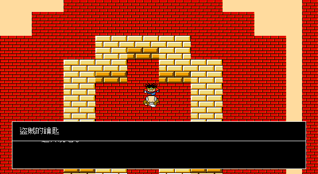

# 79 — 阿里阿罕至拿吉米之塔：第一段 P2 production-input trace

> 日期：2026-07-29（Asia/Taipei）

## 結論

既有開場 trace 已由「四人隊正常出阿里阿罕」延伸至第一個主線道具：

```text
boot → 創角 → 母親 → 國王 → 登錄／招募三人 → 正常出城
  → 地表步行到 CTY07 → 地下 transition 鏈 → CTY08 sec3
  → 話す handler12 → 盜賊鑰匙 0x55 → save/load
```

全程只呼叫 `Game.step(InputState)`；路徑搜尋只決定下一個方向，不直接修改玩家、場景、道具、
旗標或戰鬥結果。途中發生的隨機遭遇也由逐隊員命令、目標與訊息確認的正式輸入結算。

## 本批發現並修正的設定差異

1. 拿吉米塔 CTY08 的地表座標與阿里阿罕隔海，不能從 `(153,174)` 直線走入；正常入口是
   西側 CTY07 地道，再依 CTY 原始 transition table 跨場。
2. 同一 section 可能有互不連通區域，也可能由 transition 傳到同 section 的另一座標。
   因此只對 section 編號建 graph 會誤選隔牆樓梯；trace 現在把
   `(CTY, section, entry X, entry Y)` 當節點，並驗證碰撞可達性。
3. 舊 `startEncounter` 無視位置，從自造的八隻弱怪 pool 隨機挑怪，且忽略遭遇子表的單隻
   門檻，造成開局路線可生成過重怪群。現改讀原版 EXE：
   - region map：file `0x1aaa6`（DGROUP `0x4966`）
   - encounter table：file `0x1ab96`（DGROUP `0x4a56`）
   - 阿里阿罕 `(153,174)`：region 1
   - 子表：`byte1=單隻門檻`、`byte2=背景頁`、`byte4..7=候選怪`

## 驗收證據

- `TestOpeningProductionInputTrace`：boot 至 0x55，含 CTY07→08、正式交談及存讀檔。
- `TestEncounterTablesFromOriginalEXE`：鎖定 offsets、阿里阿罕 region 及原始候選。
- `TestEncounterSubtableThresholdForcesSingleEnemy`：鎖定門檻 consumer。
- Runtime 畫面：



## 尚未完成

- 原版會以同一個 38 點預算依序消費子表四個候選，形成混合怪群；現行 Go battle core 仍只
  建立單一怪種，這批只完成 region／候選／門檻資料接線。
- 戰鬥背景頁尚未依 encounter 子表 `byte2` 切換。
- 下一個 production blocker 應由這個已保存的 0x55 checkpoint 繼續走到雷貝鎮老人與魔法球，
  不應再跳回孤立 handler 測試。
