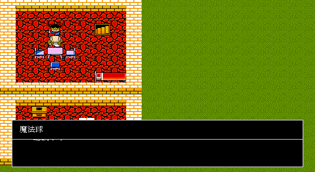

# 80 — 拿吉米回程至雷貝魔法球 production-input trace

> 日期：2026-07-29（Asia/Taipei）

## 已閉合路線

```text
CTY08 sec3（持盜賊鑰匙）
  → transition chain 回 CTY07 阿里阿罕側連通區
  → CTY07 正常出口 → 地表步行至 CTY01 雷貝
  → 正式「調查」開 sec0 door(28,8)
  → 正確 portal 落入 sec1 老人房連通區
  → 話す handler7 → 魔法球 0x58
  → save/load
```

不能從 CTY08 選最近的 `0xff` 出口：它會落在塔的隔海孤島 `(146,171)`，徒步無法到雷貝。
同樣地，CTY01 sec1 有兩個互不連通房間；只驗 `destSec=1` 會進到錯誤房間。Trace 的 graph
節點因此包含 `(CTY, section, entry X, entry Y)`，目標還必須證明能走到 NPC 的合法交談位置。

## 正式玩家資源

這段不是無敵導航：

- 在阿里阿罕道具店 facility k2 用國王的 50G 買 5 株藥草；
- 從正式裝備選單穿上國王給的銅劍 0x03；
- 隨機遭遇以逐隊員命令、目標、藥草與逐筆訊息正常結算；
- 雷貝只開原版右上屋的 tier-1 `door(28,8)`，盜賊鑰匙 0x55 不消耗。

## Transaction 與證據

- CTY01 sec1 NPC `(3,3)`：sub2 handler7。
- 已有 0x55 時給 0x58、播放 rec60，並設 `msMagicBal`；0x55 保留。
- 原版 handler 證據：`docs/re-log-722-state-machine.md` Step 8，handler `L0x521f`。
- 回歸：`TestOpeningProductionInputTrace` 從 boot 連續走到本節點並驗 save/load。



## 下一個 blocker

由本 checkpoint 正常前往誘惑洞窟，驗證在原版指定牆面從道具選單使用 0x58、地圖 mutation、
0x58 是否消耗、對話／音效，以及通往羅馬利亞的 transition chain。
