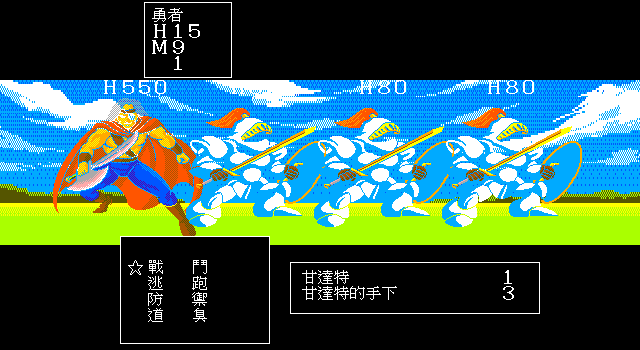

# 85 — 香巴尼塔 Kandar 原版事件與 production trace

> 2026-07-29。位址除特別標示外均為 `DQ3.EXE` file offset；CTY offset 為
> `CTY10.DAT` 檔內偏移。

## 修正的舊結論

`DQ3.EXE` logical `0xf6d6`／file `0x10a46` 是滑鼠選單 hit-test，不是玩家座標映射
runner region。舊文件若用這個 cluster 證明 `[DS:0x722]` 的玩家區域來源，該證明無效；
`[0x722]` 的其他 setter、runner consumer 與 scripted handler 研究仍可各自作為線索，
但事件必須重新由 CTY handler table 定位。

香巴尼塔 Kandar 也不是 `[0x722]` runner boss。CTY10 section 5 的特殊事件表直接指定
handler 14。

## CTY10 section 5

- section base：`0x225d`
- `section+0x04 = 0x0053`，特殊 handler byte table 位於 CTY file `0x22b0`
- table 第一個 byte=`0x0e`，即 handler 14
- 可走的 subid 1 trigger：`(6,8)`、`(7,8)`；low tile=`0x04`、attr=`0`、
  tile high low-five=`1`
- 四名盜賊 NPC：`(5,5)`、`(6,4)`、`(7,4)`、`(8,5)`；可見 flag=`0x2e`
- 金皇冠寶箱：`(4,4)`、item=`0x33`、treasure flag=`97`
- 滿月草寶箱：`(9,4)`、item=`0x45`、treasure flag=`98`

因此玩家是踏入 `(6,8)`／`(7,8)` 自動觸發 Kandar，不是調查皇冠寶箱或與盜賊談話。
在 handler 完整結束、flag `0x2e` 清除前，皇冠必須 fail closed。

## handler 14 與原版編隊

IDA 中 handler 為 `sub_15477`：

1. flag `0x2e` 未 set 則返回。
2. 播放 D3TXT02 rec84。
3. 載入 formation `DS:0x4eb5` 並戰鬥。
4. 勝利後播放 rec85。
5. Yes/No；選 No 播 rec87 並重新詢問，選 Yes 播 rec86。
6. 最後才清 flag `0x2e`，四名盜賊消失。

formation 位於 EXE file `0x1aff5`：

```text
04 18 01 1A 01 1B 01 1B 01 1B 01
```

解碼為 background `0x18`、page 1、四個 group：

- monster 26 Kandar ×1
- monster 27 Kandar 的手下 ×1
- monster 27 Kandar 的手下 ×1
- monster 27 Kandar 的手下 ×1

獎勵依每隻怪物資料加總：EXP `2200 + 80×3 = 2440`、gold `0`。

## 塔內正常路線

CTY10 section 3 入口 `(3,9)` 與上樓梯 `(9,8)` 位於不同連通區。原版移動函式
`sub_11A6A` 對 `attr&0xe000` 做兩次 `rol` 後 `and 3`：

- `attr=0x2000` → type 0，塔外跌落／離場
- `attr=0x4000` → type 1，樓梯

玩家必須繞行並用盜賊鑰匙從正式「調查」指令開啟二乘二門；production trace 實際開的是
section 3 `(8,21)`，之後才可抵達 `(9,8)` 上樓。

## Ebiten 證據

- 精訊版 trigger、flag、四個 dialogue record、formation groups/raw bytes 與皇冠 gate 全部位於
  `internal/gamepack/packs/dq3_cht/data/events.json`；Go 只實作跨版本
  `boss_surrender` primitive，沒有 Kandar raw ID／座標 fallback。
- strict loader 會拒絕未知欄位、空 trigger/formation、非法引用與 raw formation 不一致；
  `TestDQ3KandarEventMatchesOriginalEXEAndCTY` 直接對 `DQ3.EXE`／`CTY10.DAT`。
- `Battle.startFormation` 支援各 group 的 monster id、數量、HP roll、sprite、AI、
  resistance 與逐敵 reward；單一 group 仍沿用相同 RNG 語意。
- `TestShanpaneOriginalMixedFormation` 鎖定原始 formation bytes、敵序與 EXP/gold。
- `TestKandarTowerProductionRouteOpensThiefKeyDoor` 從 CTY10 section 0，以正式開門指令抵達
  section 5。
- `TestKandarNaturalTileTriggerAndMixedFormation` 由正常移動踏 `(6,8)`，播放 rec84 後
  自然進入四敵編隊。
- `TestKandarCrownGateAndOriginalSurrenderLoop` 驗證戰前不能取皇冠、No 循環、Yes 後
  flag/NPC 清除及皇冠可取得。
- `TestOpeningProductionInputTrace` 從標題開始，不用 debug shortcut，完成前置主線、北行、
  塔內開門、踏入 trigger 並進入原版混合戰。

現行 runtime：



這個切片只證明「從新遊戲到自然進入 Kandar 戰」E3；Lv4 隊伍尚未被冒充為能合法擊敗
boss。下一個 audit 必須透過原版商店、裝備、練級、旅店與教會取得足夠戰力，再完成勝利、
求饒、皇冠與羅馬利亞後續，不得削弱 boss 或注入數值。
