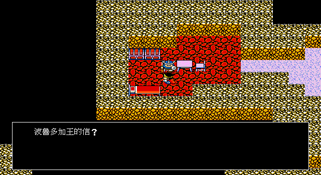
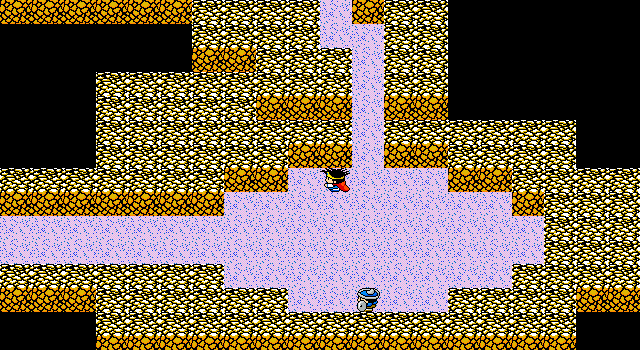
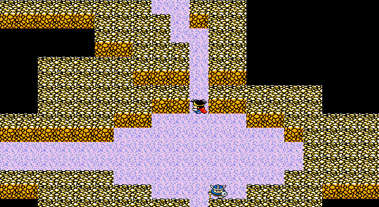

# 88 — 諾魯德密道：handler50／57 與正式玩家輸入追蹤

> 日期：2026-07-29
> 結論：精訊版不是「NPC 自動護送隊伍」。諾魯德先自行走開並交回玩家控制；玩家必須
> 自己穿過通道，踩中 CTY62 `(50,15)` 的 special tile，才會執行 handler57。

## 1. 玩家可見流程

1. 持波魯多加國王的信 `0x5b`，由 CTY62 spawn `(3,8)` 走到 `(38,6)`，面向
   `(38,5)` 的 handler50 NPC。
2. 顯示 D3TXT04 rec87；找到信後顯示 rec88。信只檢查，不消耗。
3. NPC 依原始 movement script 走到 `(50,21)`，設 flag `0x16`，然後恢復正常玩家輸入。
4. 玩家自行走到 `(50,15)`；該格 HiMap subid 為 1，而 CTY62 section+4 的第一個
   special handler 是 57。
5. handler57 顯示 rec90，NPC 從 `(50,21)` 回到 `(50,9)`、再到 `(51,9)`；清
   `0x16/0x4c`、設 `0x1c` 並重載場景。玩家留在 `(50,15)`。
6. 完成後起始 NPC 隱藏，`(51,21)` 的 completed NPC 顯示；與其交談為 rec89。

CTY63 與 CTY62 的 layout 相同，只在 map flags 與 side-specific spawn 不同；pack 保留
兩個 selector variant，但正式西側進入流程使用 CTY62。

## 2. IDA Pro 9.4 證據

本輪依 `AGENTS.md`，把 `/home/anr2/ida_94_official/dist` 唯讀掛入一次性 Docker 容器，
以 IDA Pro 9.4 為主要工具；以下位址均另外標明口徑。

| 證據 | 位址 | 結論 |
|---|---|---|
| handler50 | `sub_15DAF`，logical `0x5daf`，file `0x712f` | 檢查 flag `0x4c` 與 item `0x5b`，呼叫 movement interpreter，完成第一段後設 `0x16`。 |
| handler57 | `sub_15E6C`，logical `0x5e6c`，file `0x71dc` | 只在 `0x16` 成立時執行 rec90、回程動畫與 `clear 0x16/0x4c; set 0x1c`。 |
| movement interpreter | `sub_167C5` | 每三 byte 為 `{repeat, raw_direction, mode}`；第三 byte是 mode，不是 entity。 |
| movement consumer | `sub_121EF` | raw direction `0/1/2/3 = down/left/up/right`；mode 2 只轉身、不位移。 |
| CTY 入口 writer | `loc_13661`，file `0x49d1` | 從 DGROUP `0x748` stride 4 讀入口座標並原值寫入玩家 X/Y，沒有臆測的 `+1`。 |

原始 movement bytes：

```text
guide:  090300 020000 020300 030000 010300 0b0000 010202 ff
return: 040200 040000 ff
        010300 010202 ff
```

解碼後第一段為右 9、下 2、右 2、下 3、右 1、下 11、朝上；回程為上 12、右 1、
朝上。因此 waypoint 終點是 `(50,21)`，不是先前猜測的 `(51,21)`；兩段 final facing
都必須由 JSON 明載為 `up`。

## 3. Game-pack 與交易契約

`events.json` 的 `guided_passage_events` 保存：

- 起始／完成 NPC selector、固定互動格與 handler57 scene tile selector；
- 必要道具與是否消耗；
- `0x4c/0x16/0x1c` 三個旗標；
- 引路／回程 waypoint、兩段最終朝向、每步 frame 數與原始 movement anchor；
- rec87–90 的穩定 text ID。

Go 只提供共用 `guided_passage` 有限狀態機、loader 與 validator。缺欄位、錯誤 subid、
錯誤 handler 或未知朝向均失敗即關閉；production 沒有 DQ3 座標、旗標或文字 fallback。

## 4. 驗收

- component transaction：無信不移動、不改旗標；有信後必須等玩家踩 trigger；信不消耗；
  完成旗標與 NPC visibility 正確。
- original parity：EXE handler anchors、兩段 raw movement、CTY62/63 差異、CTY62
  special-handler table、trigger HiMap subid、D3TXT04 rec87–90 逐 word 對照。
- production trace：從 boot/new game 既有 checkpoint，以正式 `InputState` 施放 Rura 到
  已訪問的羅馬利亞，再步行至 CTY62；交談、等待 NPC、玩家自行走到 trigger、完成事件，
  並通過 save/load。沒有 debug key、環境注入或直接事件函式串流程。

Runtime 畫面：








目前評級為 **E3 / V2**：正式玩家流程及交易已閉合，runtime 畫面已產出並與本機原版影片
同狀態核對；但 remake 尚未完整呈現原版四人縱列，因此不能宣稱 V3。下一個 production
blocker 是從此 checkpoint 前往巴哈拉達，重查並閉合救人、黑胡椒與回波魯多加取船。
