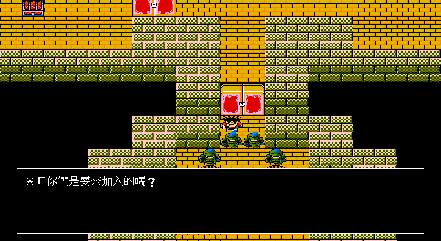
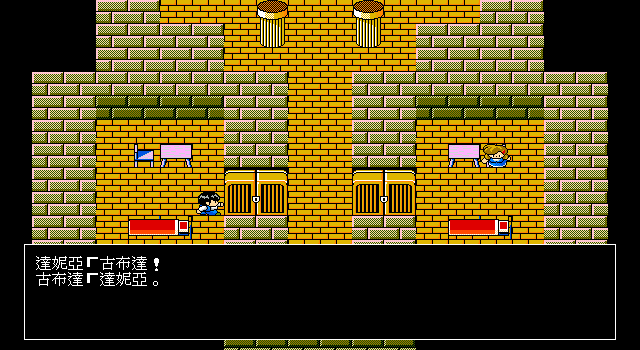

# 89 — 巴哈拉達救援、甘達特與黑胡椒正式流程

> 日期：2026-07-30
> 範圍：諾魯德東口 checkpoint → CTY15 → CTY14 救援 → CTY15 黑胡椒 → save/load
> 結論：事件設定 D3、玩家流程 E3、runtime 畫面 V2；尚未宣稱逐像素 V3。

## 原版證據閉合

本切片以本機完整影片 20:00–24:00、`DQ3.EXE`、`CTY14.DAT`、`CTY15.DAT` 與
`D3TXT03.TXT` 交叉驗證。舊 C remake 的簡化 boss token 與自造完成旗標不是原版規格，
已移除，不在本文保留其錯誤數值。

- CTY14 section0 → section1 的原始 transition entry 是
  `{dest_cty=14,dest_section=1,x=26,y=3}`。IDA Pro 9.4 追到 `sub_13534`：
  同 CTY 跨 section 載入後，把 entry 的 X/Y 寫入玩家座標；section1 header 內越界的
  spawn 不參與這次轉場。
- `(26,3)` 至中央房必須用魔法鑰匙開 `(15,10)` 的 tier2 門；正式 trace 經「調查」
  開門，沒有 fallback spawn 或穿牆。
- handler58 的四守衛由 DS `0x4ec0` formation
  `01 18 01 39 04` 產生 `monster57×4`。
- handler59／60 使用旗標 `0x81`／`0x82`、tile subid 1／2，以及 movement raw
  `020000020300ff`、`030300ff`、`020000050100ff`。
- handler61 的返回 boss formation 位於 DS `0x4ec5`：
  `04 18 01 38 01 39 01 39 01 39 01`，即
  `monster56×1 + monster57×1 + monster57×1 + monster57×1`。
- 接受求饒後 SET `0x25`、CLEAR `0x14/0x34`。CTY15 section0 `(5,24)` handler25
  在 `0x36` set 時給 item `0x5c`，成功後清 `0x36`。
- 玩家文字逐 word 對拍 D3TXT03 rec86–87、106–120、124；Go runtime 只引用
  `texts.json` 的穩定 text ID。

位址若未另標均為原版 logical；formation 與 movement 的 canonical raw bytes 由
`TestBaharataRescueMatchesOriginalEXECTYAndText` 鎖定。

## game pack 與引擎邊界

schema `0.1.5` 新增 `hostage_rescue_events`。DQ3 專屬 NPC／trigger selector、旗標、
formation、movement、文字與黑胡椒交易全部位於 `data/events.json`／`data/texts.json`；
Go 只提供具型別的有限狀態機、validator、戰鬥與 movement primitive。

本切片同時修正一個通用場景問題：story flag 改變後，已快取的其他 CTY 仍保存舊 NPC
可見性。現在只有在旗標值實際改變時才使 CTY cache 失效；目前 scene 繼續完成當幀動畫，
下次進城／切 section 依新旗標重建。這使救援前已造訪的 CTY15 在返回後能正確載入古布達。

## 正式玩家輸入追蹤

`TestOpeningProductionInputTrace` 從新遊戲延伸，沒有 debug key、環境捷徑或直接設定救援
旗標：

1. 由諾魯德東口步行抵達 CTY15，save/load checkpoint。
2. 用已學會的魯拉回羅馬利亞低危區，以真實遭遇、教會與旅店練至 Lv18，再回 CTY15
   購買藥草。
3. 步行至 CTY14，經 section0 原始門與 section1 tier2 魔法門進入中央房。
4. 正式交談拒絕加入四守衛，擊敗 `monster57×4`。
5. 踩 handler59 格、播放呼救並完成第一段 NPC movement。
6. 踩 handler60 牆上開關，選是，逐頁播放文字並完成兩名俘虜 movement。
7. 與返回的甘達特交談，擊敗 `monster56×1 + monster57×3`。
8. 求饒先選否確認重問，再選是完成原版旗標交易。
9. 沿正式 transition 返回地表與 CTY15，與新載入的古布達交談、選是取得黑胡椒。
10. 保存並重新載入，確認 `0x5c`、完成旗標與一次性 availability flag 均持久。

戰鬥路線使用正常補給。巴哈拉達周邊的 monster43 異常咒文曾暴露全體不能行動時的
無限訊息風險；本切片沒有猜改原版異常持續時間，而是採正常玩家可行的低危區準備路線。
該機制差異另列後續 RE，不作本事件設定的替代答案。

## 畫面核對

本機原版影片 20:00–22:00 可見三個十字房、魔法門、四守衛與俘虜房；22:00–24:00
可見返回甘達特的 `1+3` 混合編隊、求饒、離洞與回巴哈拉達。remake 的場景結構、
NPC 數量、編隊與流程相符。戰鬥背景 palette／HUD 尺寸仍與原版影片有差異，因此只記
V2，不標 V3。

## 後續狀態

黑胡椒 checkpoint 至波魯多加取船、地表停泊、save/load 與首次正式航行已於
[`docs/90`](90-portoga-ship-production-trace.md) 閉合至 E3。下一個連續 blocker 已移至
達瑪神殿／加爾那之塔的《領悟之書》流程。
