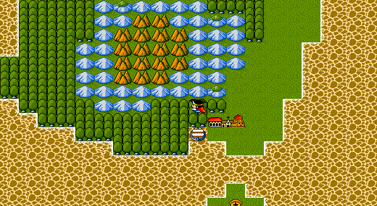
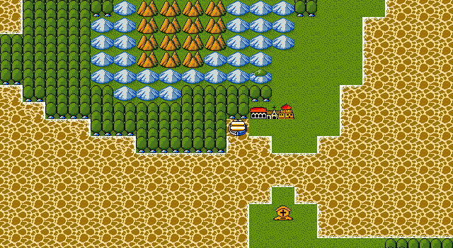

# 90 — 波魯多加取船與首次航行 production trace

> 更新：2026-07-30。原版靜態證據集中於 [`docs/50`](50-ship-acquisition.md) 與
> [`docs/48`](48-ship-navigation.md)；本檔只記錄從黑胡椒 checkpoint 延伸的正式玩家流程。

## 原版事件契約

`DQ3.EXE` handler26 `(file 0x6ae1..0x6b75)` 在首次晉見後讀原版 flag `0x38`：

1. 缺 item `0x5c` 時顯示 D3TXT04 rec26，不改背包或車輛狀態。
2. 持 item `0x5c` 時只消耗一件黑胡椒，清 flag `0x2c`，把船停泊在
   world `(25,73)`、layer `0`，顯示 rec27。
3. flag `0x38` 並不在成功交易中清除；完成後由已取得船的狀態進入 rec28 分支。

CTY37 section0 國王 selector 為 `(9,6)`、handler26。NPC、旗標、道具、船種、停泊位置、
需清旗標與五段 text ID 均由 `dq3_cht` 的 `staged_vehicle_exchange_events` 提供；共用 Go
狀態機不含波魯多加、黑胡椒或 DQ3 raw ID。

## 正式玩家輸入追蹤

`TestOpeningProductionInputTrace` 從新遊戲起的同一條 trace 繼續：

1. 保存黑胡椒 checkpoint 後重建 `Game`，由標題主選單以正式輸入選擇載入。
2. 在 CTY15 走到旅店，以正式設施流程恢復巴哈拉塔迷宮消耗的 MP。
3. 正式出城、由命令窗施放魯拉至已造訪的 CTY16，再走入 CTY37 王宮。
4. 與 handler26 國王交談；驗證黑胡椒消失、flag `0x38` 保留、`vehicle.clear_flags_raw`
   的 `0x2c` 清除、船停泊 `(25,73,L0)`。
5. 保存取船 checkpoint，重建 `Game` 並再次由標題主選單正式載入；船、背包、旗標與
   停泊位置皆保持一致。
6. 依 CTY transition 正式出城，尋路到船旁陸格，送方向輸入走上船格，再向相鄰水格
   航行一格；全程不使用 debug key、環境變數、直接事件呼叫或狀態注入。

這段揭露了兩個孤立 component test 看不到的路徑條件：巴哈拉塔迷宮後必須正常補充 MP，
以及 checkpoint 必須經標題 UI owner 載入，不能直接呼叫 `Load()` 後把仍開啟的標題畫面
當成可操作遊戲狀態。

## 畫面證據

三張圖皆由真實 world map、game-pack 停泊資料與 production renderer 產生。後兩張另經
`Game.step(InputState)` 完成登船與航行；正常玩家可達性由完整 production trace 獨立證明。
目前為 V2，尚未取得同狀態、同座標的原版 DOSBox 對照，因此不標 V3。

## 驗收結果與下一個 blocker

- 事件設定：D3。
- runtime 與狀態交易：E2。
- 新遊戲連續玩家流程、事件後存讀檔及首次航行：E3。
- 畫面：V2。

下一個連續 audit 由首次航行 checkpoint 前往達瑪神殿／加爾那之塔，閉合《領悟之書》
`0x4a` 的正常入口、寶箱 gate、存讀檔與後續可達性；不能用既有孤立事件或遠端 checkpoint
代替。
