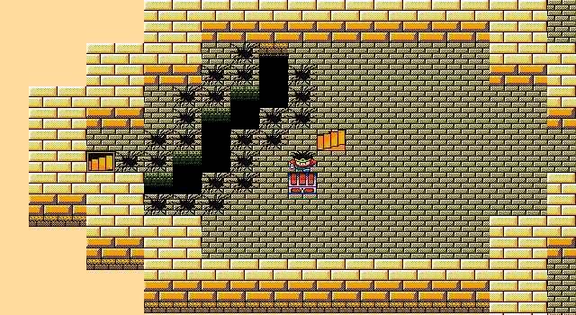
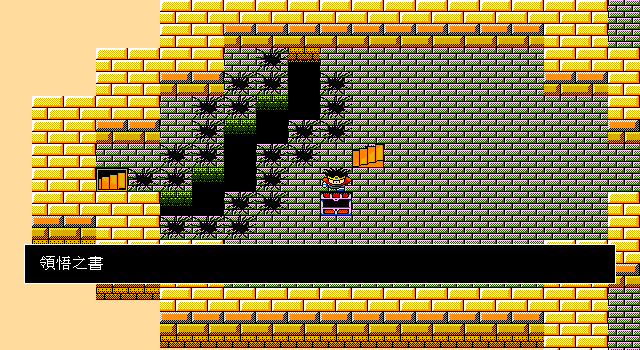

# 加爾那之塔《領悟之書》正式流程與睡眠恢復修正

日期：2026-07-30
範圍：波魯多加首次航行 checkpoint → 加爾那之塔 CTY18 →《領悟之書》`0x4a`

## 結論

boot 起的同一條 `TestOpeningProductionInputTrace` 現可只靠正式 `InputState`：

1. 讀回波魯多加取船 checkpoint，正常出城、登船並航行。
2. 處理航海隨機遭遇，不再因全隊睡眠／混亂永久空轉。
3. 由地表正常入口進 CTY18，依原始 transition 繞
   `sec1 → sec2 → sec3 → sec4 → sec1` 的不同連通區。
4. 從命令窗選「調查」，取得《領悟之書》`0x4a`，清 present flag `0xb7`，
   並立即把寶箱 low tile 加一、清除 event subid。
5. 正常存檔，由標題選單讀回後，道具、旗標、CTY18 sec1 checkpoint 均一致。

本切片為 E3；現行 runtime 圖為 V1，尚缺 DOSBox 同狀態像素對拍，不能標成 V3。

## 原版寶箱證據

CTY18 sec1 examine table：

```text
section base = file 0x0e54
event table  = file 0x0e6d
count        = 1
subid 0      = 01 4a 00 b7
```

即 `{type=1,item=0x004a,present_flag=0xb7}`。IDA Pro 9.4 追蹤：

```text
dispatcher：IDA 0x18986（file 0x9cf6）
type branch：IDA 0x18a16（file 0x9d86）
type 1/3 inventory consumer：IDA 0x18a79（file 0x9de9）
```

consumer 逐角色掃八格背包，找到空格才寫入 item；滿載時顯示原版訊息且不得寫入。
`TestDQ3GarunaSatoriBookMatchesOriginalEXEAndCTY` 同時鎖定 JSON selector、CTY 四個 raw
bytes 與 EXE dispatcher／consumer 指令，不以舊 C remake 當 oracle。

## 航海 blocker：睡眠／混亂不是永久狀態

首次重播在怪物 43 的四敵編隊停住。快照看似停在最後一則「我方陷入幻惑」，實際訊息
確認能正常返回下一回合；真正死循環是全隊被異常後，舊 Go 把狀態永久保存：

- command actor 全被略過；
- 敵方只繼續施放狀態，未必造成致死傷害；
- `wipedOut()` 因我方仍有 HP 不判敗；
- 戰鬥永遠無可動角色。

IDA 補證閉合如下：

```text
玩家 writer：
  IDA 0x1ae76..0x1ae81（file 0xc9e6..0xc9f1）
  → 角色 +0x38 OR 0x20

玩家 consumer：
  IDA 0x1b4f6（file 0xc866）
  → test bit0x20 → rng
  → roll <= 0x64：清 bit、rec354「醒來」、跳過當回合
  → roll >  0x64：rec349「還沒醒來」、跳過當回合

怪物 consumer：
  IDA 0x1a973（file 0xbce3）
  → test bit0x80 → rng
  → roll < 0x64：清 bit、rec355、跳過當回合
  → roll >=0x64：rec350、跳過當回合
```

玩家與怪物在 `roll==100` 的邊界不同。Go 以兩個具名 threshold helper 實作，並由
99／100／101 component tests 鎖定。玩家可見文字來自 game-pack
`common:text.battle.status.sleeping/woke`，production Go 沒新增版本專屬句子。

## game-pack 與引擎邊界

schema `0.1.6` 新增 `treasure_events`。DQ3 pack 宣告：

```json
{
  "id": "dq3:event.garuna_satori_book",
  "kind": "treasure",
  "treasure": {
    "cty_raw": 18,
    "section": 1,
    "tile_subid": 0,
    "event_type_raw": 1,
    "item_raw_id": 74,
    "present_flag_raw": 183
  }
}
```

Go 只保留通用 treasure selector、validator、present-flag 交易、tile rebuild 與
save/load primitive；舊 production `treasures` table 的 CTY18 entry 已移除。缺欄位、
重複 selector 或未知 reference 一律失敗即關閉。

## runtime 圖

取得前：



取得後（同一幀已切換為開啟寶箱 tile，顯示 pack item 名稱）：



`TestDumpGarunaSatoriBook` 以真實 CTY18、原始 event tile 與現行 renderer 產圖，並斷言
取得後 low tile `+1`、event subid 已清。正式可達性仍由完整 production trace 負責，
圖片 fixture 不代替玩家路徑驗收。

## 下一個連續工作

從《領悟之書》讀檔 checkpoint 繼續前往達瑪神殿，以正式設施入口驗證轉職選單、
賢者 gate、成功消耗、角色能力交易與 save/load；不可直接呼叫 reclass handler。
