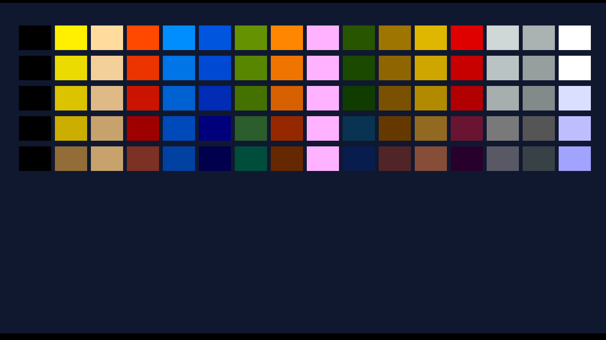

# dq3_remake_ebitan — 精訊 DQ3 的 Go / Ebiten port

> 把 [`../dq3_remake`](../dq3_remake)(C99 + SDL2)的精訊 DQ3 remake 用 **Go + Ebiten(Ebitengine)** 重寫,
> 主要為了**乾淨的 Android / iOS / WASM 移植**。評估與分階段 plan:[`../docs/62`](../docs/62-golang-ebiten-android-port-eval.md)。

## 目錄

- [為什麼 Go/Ebiten](#為什麼-goebiten)
- [✅ 成果證明:Ebiten 已跑起來](#-成果證明ebiten-已跑起來)
- [結構](#結構)
- [建置 / 執行](#建置--執行)
- [進度(對照 docs/62 八階段)](#進度對照-docs62-八階段)
- [原則](#原則)

## 為什麼 Go/Ebiten

Ebiten 的**行動裝置 / 觸控 / OGG 音訊是一等公民**,正好消掉 C/SDL2 移 Android 最痛的三塊
(NDK/SDLActivity、三 ABI libvorbis 交叉編譯、觸控 UI)。同一份碼還能編 **桌面(Win/Mac/Linux)+ WASM(瀏覽器)**。
困難的反組譯已在 C 版完成 → 這裡是**翻譯已知邏輯**,不是重新發現(詳見 [docs/62](../docs/62-golang-ebiten-android-port-eval.md))。

## ✅ 成果證明:Ebiten 已跑起來

**階段 1 里程碑達成**:Ebiten 在 Xvfb + Mesa 軟體 GL 下實際渲染 —— 載入**真實 `DQ3.PAL`**、用移植的
Go parser(`internal/dq3data`)解碼、Ebiten 畫成 palette swatches。這張是實際截到的畫面像素:



- 深藍底 = Ebiten `screen.Fill(RGBA{16,24,48})`;80 個色塊 = `DQ3.PAL`(240 bytes)經 `DecodePalette` 解出的 80 色。
- 證明**端到端管線通**:真實資產 → Go 解析(對拍 C 版逐色一致)→ Ebiten 渲染 → 螢幕像素。
- toolchain:**Ebiten v2.9.9 / Go 1.24 compile + run OK**(全在 docker,不污染 host)。

## 結構

```
dq3_remake_ebitan/
├── go.mod / go.sum        # module(Ebiten v2.9.9)
├── main.go                # Ebiten Game shell(開窗/主迴圈/Layout 640×350)
├── internal/dq3data/      # ★ 純 Go 資料解析器(移植自 C;無引擎相依,可 headless 測)
│   ├── palette.go         #   DQ3.PAL 解碼(移植 dq3_pal_decode)
│   └── palette_test.go    #   對拍真實 DQ3.PAL(逐色驗證與 C 公式一致)
├── docs/phase1-palette.png# 上方成果截圖
└── build.sh               # docker golang 建置(不污染 host):test + Ebiten compile-check
```

## 建置 / 執行

```bash
bash dq3_remake_ebitan/build.sh          # docker：純 Go 單測(對拍真實素材)+ Ebiten shell compile-check
```
本機實跑(需顯示器):
```bash
cd dq3_remake_ebitan && DQ3_ASSETS=/path/to/assets_raw go run .
```
> 素材(原版 `assets_raw/`)使用者合法持有、gitignore 不散布;需原版 `DQ3.EXE` 啟動(版權閘)。

## 進度(對照 docs/62 八階段)

- [x] **階段 1 骨架**:Go module + Ebiten 開窗/主迴圈/Layout(640×350);**管線驗證 + 截圖**(見上)。
- [x] **階段 2 資料解析移植**(核心三件到位):
  - [x] **palette**(DQ3.PAL,移植 `dq3_pal_decode`)+ 對拍測試(逐色一致)
  - [x] **BLK tile**(DQ3.BLK,移植 `dq3_blk_open`/`dq3_blk_tile`)+ 對拍測試(162 tiles、32×24 4-bit planar、header 4/24 對 C)
  - [x] **地表 tilemap**(DQ3CON.MAP,移植 `dq3_field_load_map` header)+ 對拍測試(244×205=50020 格、tile 索引全在 BLK 範圍)
  - [x] **角色 sprite BLS**(DQ3MST.BLS 主角,移植 `dq3_charsprite_load`:stride 960 / 2 walk sub-frame / 4-plane + mask)+ 對拍測試(8 frame、有不透明像素、決定性)
  - [ ] text(D3TXT)/ CTY 城鎮載入 / monster / item / save … 逐一移植 + Go 測對拍 C
- [x] **階段 3 渲染 + 互動(可走動地表)**:`main.go` 把 fieldmap tile → BLK tile(32×24 indexed)→ palette → 640×350 RGBA → `ebiten.Image`;
  **主角 sprite masked blit(透明背景疊地形)**、**viewport 隨主角捲動**、**方向鍵移動 + 走路動畫**。本機 Xvfb 驗證:
  主角站在真實 DQ3 地表(綠地/森林/山脈/水域/沙漠)上、可走動。**朝「可玩」一大步。**
  > ★ 地表/主角畫面 = 遊戲版權美術 → 依專案政策**不截圖入庫**;公開證明用 palette 截圖(上方,純色塊)。
  > 踩雷紀錄:Ebiten `WritePixels` 下一幀才生效 → 渲染要在 `Update()` 做、`Draw()` 只 `DrawImage`(否則同幀畫到舊的黑圖)。
- [ ] **階段 4 遊戲邏輯**:場景移動/碰撞/NPC、對話、選單、戰鬥(公式/AI/升級)、事件/傳送(對 game_tester 斷言移 Go 測)
- [ ] **階段 5 音訊**:MT-32 OGG(Ebiten `audio/vorbis` 內建,先)+ VOC 音效;SB-FM OPL2 之後補
- [ ] **階段 6 輸入 + 觸控 UI**:鍵盤(桌面/web)+ 虛擬方向鍵/A/B/選單(行動)
- [ ] **階段 7 Android**:`ebitenmobile bind` → `.aar` → Android Studio + 素材入 APK + 版權閘 → APK/AAB
- [ ] **階段 8 紅利**:同碼編 WASM(瀏覽器 demo)+ 桌面

## 原則

C 版 `dq3_remake/` 的原始碼 + `docs/` + `game_tester` 斷言 = 本 port 的**規格與對拍 oracle**。
每移植一個 parser / 邏輯,就寫 Go 測**對拍 C 版**,確保翻譯正確、不引入回歸。
