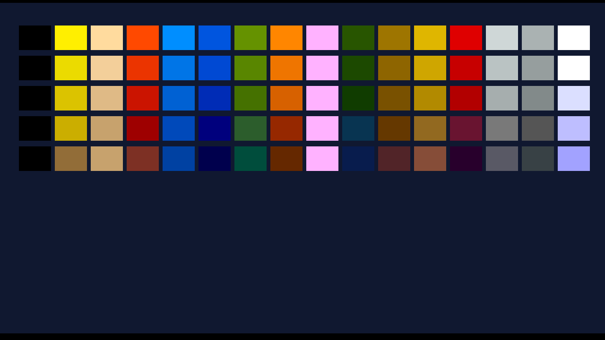

# dq3_remake_ebitan — 精訊 DQ3 的 Go / Ebiten port

> 把 [`../dq3_remake`](../dq3_remake)(C99 + SDL2)的精訊 DQ3 remake 用 **Go + Ebiten(Ebitengine)** 重寫,
> 主要為了**乾淨的 Android / iOS / WASM 移植**。評估與分階段 plan:[`../docs/62`](../docs/62-golang-ebiten-android-port-eval.md)。

## 目錄

- [為什麼 Go/Ebiten](#為什麼-goebiten)
- [✅ 成果證明:Ebiten 已跑起來](#-成果證明ebiten-已跑起來)
- [結構](#結構)
- [建置 / 執行](#建置--執行)
- [進度(對照 docs/62 八階段)](#進度對照-docs62-八階段)
- [原則](#原則)

## 為什麼 Go/Ebiten

Ebiten 的**行動裝置 / 觸控 / OGG 音訊是一等公民**,正好消掉 C/SDL2 移 Android 最痛的三塊
(NDK/SDLActivity、三 ABI libvorbis 交叉編譯、觸控 UI)。同一份碼還能編 **桌面(Win/Mac/Linux)+ WASM(瀏覽器)**。
困難的反組譯已在 C 版完成 → 這裡是**翻譯已知邏輯**,不是重新發現(詳見 [docs/62](../docs/62-golang-ebiten-android-port-eval.md))。

## ✅ 成果證明:Ebiten 已跑起來

**階段 1 里程碑達成**:Ebiten 在 Xvfb + Mesa 軟體 GL 下實際渲染 —— 載入**真實 `DQ3.PAL`**、用移植的
Go parser(`internal/dq3data`)解碼、Ebiten 畫成 palette swatches。這張是實際截到的畫面像素:



- 深藍底 = Ebiten `screen.Fill(RGBA{16,24,48})`;80 個色塊 = `DQ3.PAL`(240 bytes)經 `DecodePalette` 解出的 80 色。
- 證明**端到端管線通**:真實資產 → Go 解析(對拍 C 版逐色一致)→ Ebiten 渲染 → 螢幕像素。
- toolchain:**Ebiten v2.9.9 / Go 1.24 compile + run OK**(全在 docker,不污染 host)。

## 結構

```
dq3_remake_ebitan/
├── go.mod / go.sum        # module(Ebiten v2.9.9 + audio/vorbis + mobile)
├── main.go                # 桌面進入點(薄:os.DirFS 組資產 → game.NewGame → RunGame)
├── game/                  # ★ 遊戲邏輯套件(桌面 + Android 共用)
│   ├── game.go            #   Scene/Game/NewGame、Update/renderFrame、攝影機、碰撞
│   ├── dialogue.go        #   對話框(移植 dq3_dialogue)+ glyph/框繪製
│   ├── cmdmenu.go         #   野外命令窗(移植 dq3_cmdmenu)
│   ├── input.go           #   抽象輸入層 InputState(鍵盤+觸控合流,deep module)
│   └── touch.go           #   虛擬觸控(浮動十字鍵 + A/B,多點觸控)
├── internal/dq3data/      # ★ 純 Go 資料解析器(移植自 C;無引擎相依,headless 對拍)
│   ├── palette/blk/fieldmap/bls/attr/townmap/text.go  # 各格式解析 + _test 對拍
├── internal/gaudio/       # MT-32 OGG 音樂(Ebiten audio/vorbis;fs.FS 來源)
├── mobile/                # Android/iOS 綁定(ebitenmobile;//go:embed assets）
│   ├── mobile.go          #   mobile.SetGame(game.NewGame(embedFS))(android||ios tag)
│   └── assets/            #   綁定前放原版素材(版權 gitignore)
├── build.sh               # docker golang 建置 + 測試
└── build-android.sh       # ebitenmobile bind → .aar（需本機 Android SDK/NDK）
```

## 建置 / 執行

```bash
bash dq3_remake_ebitan/build.sh          # docker：純 Go 單測(對拍真實素材)+ Ebiten shell compile-check
```
> 測試分兩層:`internal/dq3data`(資料解析對拍)**無引擎相依,可完全 headless 跑**;
> `package main`(對話/命令窗等 UI 邏輯)因 import Ebiten,其 `init()` 需要 display →
> headless 測試需先起 `Xvfb`(見 `build.sh`)。
本機實跑(需顯示器):
```bash
cd dq3_remake_ebitan && DQ3_ASSETS=/path/to/assets_raw DQ3_MT32=/path/to/work/mt32 go run .
# 操作:方向鍵走動、Space=A(對話/命令窗選定)、Esc=B(取消/出城)、Enter=進阿里阿罕城
```
> 素材(原版 `assets_raw/`)使用者合法持有、gitignore 不散布;需原版 `DQ3.EXE` 啟動(版權閘)。

## 進度(對照 docs/62 八階段)

- [x] **階段 1 骨架**:Go module + Ebiten 開窗/主迴圈/Layout(640×350);**管線驗證 + 截圖**(見上)。
- [x] **階段 2 資料解析移植**(核心三件到位):
  - [x] **palette**(DQ3.PAL,移植 `dq3_pal_decode`)+ 對拍測試(逐色一致)
  - [x] **BLK tile**(DQ3.BLK,移植 `dq3_blk_open`/`dq3_blk_tile`)+ 對拍測試(162 tiles、32×24 4-bit planar、header 4/24 對 C)
  - [x] **地表 tilemap**(DQ3CON.MAP,移植 `dq3_field_load_map` header)+ 對拍測試(244×205=50020 格、tile 索引全在 BLK 範圍)
  - [x] **角色 sprite BLS**(DQ3MST.BLS 主角,移植 `dq3_charsprite_load`:stride 960 / 2 walk sub-frame / 4-plane + mask)+ 對拍測試(8 frame、有不透明像素、決定性)
  - [x] **tile 碰撞屬性**(BLKBM.DAT,移植 `dq3_scene_walkable`:每 tile u16、`attr&1`=不可走)+ 對拍測試(400B→200 屬性、49 阻擋/151 可走)
  - [x] **CTY 城鎮載入 + NPC**(CTY00.DAT 阿里阿罕,移植 `dq3_town_load` + `dq3_scene_load_npcs`:section 偏移表無 count 前綴、layout `{w,h,tiles}`@+0x0e、spawn@+0x13/+0x14、NPC 表日/夜 word[0/1]→count+7B record)+ 對拍測試(42×43、spawn 0,28、**NPC=24 對齊 C boot**、tiles 全在 DQ31.BLK)
  - [x] **文字 + 字型**(D3TXTnn.TXT + D3TXT00.FON,移植 `dq3_text`/`dq3_font`:指標表記錄、2B glyph 碼串、16×16 字模 2B/列 MSB)+ 對拍測試(D3TXT01=100 記錄、FON 1476 字模、461 相異字有墨)
  - [ ] monster / item / save … 逐一移植 + Go 測對拍 C
- [x] **階段 3 渲染 + 互動(可走動地表 + 進城)**:`Scene` 抽象統一地表/城鎮的 render + 碰撞;
  fieldmap/town tile → BLK tile(32×24 indexed)→ palette → 640×350 RGBA → `ebiten.Image`;
  **主角 sprite masked blit(透明背景疊地形)**、**攝影機 clamp 隨主角捲動(邊緣不露黑,對齊 C VIEW 20×15)**、
  **方向鍵移動 + 走路動畫**、**BLKBM 碰撞 + NPC 擋路(不可穿山/海/牆/人)**、**城內 24 隻 NPC sprite(DQ3MAN.BLS)**、
  **Enter 進阿里阿罕城 / Esc 回地表**。本機 Xvfb 驗證:進城見阿里阿罕(ルイーダの酒場「PUNCH LUIDA」+「HOTEL」宿屋招牌、
  24 隻村民 NPC 散佈、磚房、道路),攝影機貼邊不露黑。**朝「可玩」一大步。**
  > ★ 地表/城鎮/主角畫面 = 遊戲版權美術 → 依專案政策**不截圖入庫**;公開證明用 palette 截圖(上方,純色塊)。
  > 踩雷紀錄:Ebiten `WritePixels` 下一幀才生效 → 渲染要在 `Update()` 做、`Draw()` 只 `DrawImage`(否則同幀畫到舊的黑圖)。
- [~] **階段 4 遊戲邏輯(進行中)**:
  - [x] **對話**:空白鍵(A)面向 NPC → 依 `(ctrl>>3)&7` 子型開對話(rec=b4),對話框逐頁 A 推進 / 結尾關閉
    (移植 `dq3_dialogue`:底部 4 行視窗、分頁 scan_page、換行/換頁/插值占位控制碼)。Xvfb 驗證顯示真實中文對話。
  - [x] **命令窗**(對話/咒文/狀況/道具/裝備/調查,2 欄×3 列,標籤 glyph 取自 D3TXT00 rec400):A 開窗、方向移游標、
    A 選定、B 關窗(移植 `dq3_cmdmenu`,游標繞回對拍測試)。**對話**指令已通;咒文/狀況/道具/裝備/調查待接對應系統。
  - [ ] 設施(店/宿)、場景轉場、戰鬥(公式/AI/升級)、事件/傳送
- [~] **階段 5 音訊(進行中)**:
  - [x] **MT-32 音樂**(`internal/gaudio`,Ebiten `audio/vorbis` 純 Go 解碼 + `InfiniteLoop`):
    場景→軌對齊 C `dq3_audio`(地表 FIELD=6、阿里阿罕 CASTLE=1),進城/回地表自動換軌;
    全非致命(無檔/無音訊裝置 → 靜音降級)。headless 解碼對拍測試(track_06/01 解出 7M/8.8M samples)。
    執行需 `DQ3_MT32=<track_NN.ogg 目錄>`(未設 → 靜音)。
  - [ ] VOC 音效;SB-FM OPL2 即時合成(最硬,之後補)
  > ⚠ headless/CI 無 ALSA 裝置時,設了 `DQ3_MT32` 會讓 oto 開裝置失敗 → 請留空 `DQ3_MT32`(靜音)或給 dummy ALSA;真機/桌面有音效卡則正常播放。
- [x] **階段 6 輸入 + 觸控 UI**(依 [docs/63 規劃](../docs/63-ebiten-android-touch-ui-plan.md)實作):
  - [x] **抽象輸入層**(`input.go` `InputState`):遊戲邏輯只依賴抽象動作(DirHeld/DirEdge/Confirm/Cancel),
    鍵盤 + 觸控兩個來源 OR 合流,邏輯不知來源(deep module)。`Update()` 已全改讀 `InputState`。
  - [x] **虛擬觸控**(`touch.go`):左下浮動十字鍵(4 向量化 + 死區)+ 右下 A/B,半透明疊層、**多點觸控**
    (十字鍵 + 按鈕同時)、有觸控過才顯示(免擾桌面)。`quantize4`/`zoneOf` 單元測試。Xvfb 截圖驗證疊層。
  - [ ] 情境化 A/B 標籤、安全區 inset、DeviceScaleFactor 尺寸(打磨,之後)
- [~] **階段 7 Android(結構就緒)**:
  - [x] **可綁定架構**:遊戲邏輯抽進 `game/` 套件(桌面 `main.go` 與行動 `mobile/` 共用);
    資產改走 `fs.FS`(`NewGame(assets, music fs.FS)`)→ 桌面 `os.DirFS`、行動 `embed.FS`。
  - [x] **mobile 綁定套件**(`mobile/mobile.go`,`//go:embed assets` + `mobile.SetGame`)+ `build-android.sh`
    (`ebitenmobile bind -target android` → `.aar`)。桌面 `go build ./...` 不受影響(build tag 隔離)。
  - [ ] 實跑 `ebitenmobile bind` → APK/AAB:**需本機 Android SDK + NDK**(不在 docker 內做);素材放 `mobile/assets/`(版權,gitignore)。
- [ ] **階段 8 紅利**:同碼編 WASM(瀏覽器 demo)+ 桌面

## 原則

C 版 `dq3_remake/` 的原始碼 + `docs/` + `game_tester` 斷言 = 本 port 的**規格與對拍 oracle**。
每移植一個 parser / 邏輯,就寫 Go 測**對拍 C 版**,確保翻譯正確、不引入回歸。
